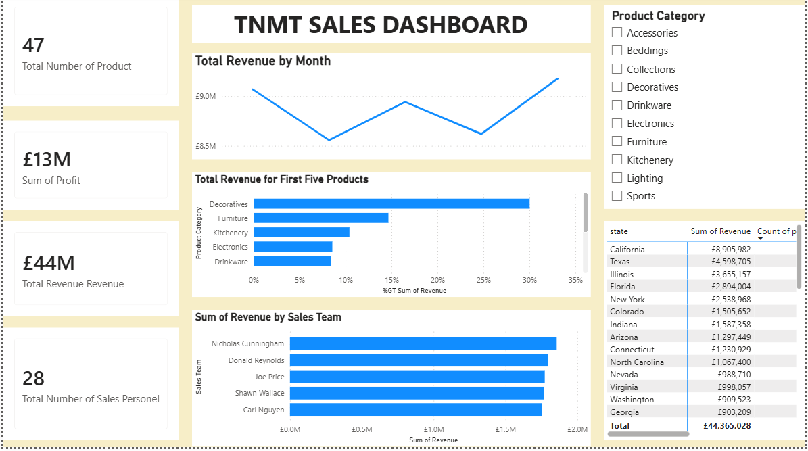

# TNMT Retail Sales Analysis Report

## Project Overview

This project presents a comprehensive sales performance analysis for **TNMT Retail**, designed to provide management with actionable insights into revenue generation, profitability, product performance, sales team effectiveness, and state-level sales distribution.

The report and dashboard was developed using **Microsoft Power BI and Dashboard Design Techniques** to transform raw transactional data into meaningful business intelligence.

---

## Business Problem

The Sales Director requested an analysis to:

1. Calculate **Revenue** and **Profit** for every transaction.
2. Create reports showing:
   - Revenue trends over time
   - Product performance by revenue
   - Revenue contribution by product category
   - Sales team performance
   - State-level revenue analysis
3. Develop an interactive dashboard that can be filtered by **Product Category**.
4. Generate insights to answer key business questions:
   - Which products generated the highest revenue?
   - Which sales team performed best within specific product categories?
   - Is there any relationship between revenue, population, and median income across states?

---

## Objectives

The primary objectives of this project were:

- Analyze overall business performance.
- Identify top-performing products and categories.
- Evaluate sales team effectiveness.
- Monitor monthly revenue trends.
- Compare sales performance across states.
- Enable interactive decision-making through dashboard filtering.

---

## Dataset Description

The dataset contains retail transaction records including:

- Order Information
- Product Categories
- Product Names
- Revenue Data
- Profit Data
- Sales Personnel
- State Information
- Population Statistics
- Median Income Data

---

## Data Preparation

The following data preparation steps were completed:

### Revenue Calculation

Revenue was calculated for each transaction using:

```DAX
Revenue = 'Sales table' [Order Quantity] * 'Sales table' [Unit Price]
```

### Profit Calculation

Profit was calculated using:

```DAX
Profit = 'Sales table' [Revenue] - 'sales table' [Order Quantity] * 'Sales table'[Unit Cost] 
```

### Data Cleaning Activities Using Power Query

- Checked for missing values.
- Removed duplicate records.
- Standardized category names.
- Validated numerical fields.
- Ensured consistency across dimensions.
- Removed redudant columns.

---

## Dashboard Components

### KPI Cards

The dashboard provides high-level performance metrics:

| KPI | Value |
|------|--------|
| Total Products | 47 |
| Total Revenue | £44M |
| Total Profit | £13M |
| Total Sales Personnel | 28 |

---

### Revenue Trend Analysis

**Visualization:** Line Chart

Displays monthly revenue performance and helps identify:

- Seasonal patterns
- Revenue growth periods
- Revenue decline periods

---

### Top Product Categories by Revenue

**Visualization:** Horizontal Bar Chart

Shows the contribution of the leading product categories to total revenue.

Key categories include:

- Decoratives
- Furniture
- Kitchenery
- Electronics
- Drinkware

---

### Sales Team Performance

**Visualization:** Horizontal Bar Chart

Measures revenue generated by each sales representative.

Top-performing team members include:

- Nicholas Cunningham
- Donald Reynolds
- Joe Price
- Shawn Wallace
- Carl Nguyen

---

### State Revenue Analysis

**Visualization:** Interactive Table

Provides:

- Revenue generated by state
- Revenue ranking across states

Top revenue-generating states include:

1. California
2. Texas
3. Illinois
4. Florida
5. New York

---

### Product Category Filter

**Visualization:** Slicer

Allows users to dynamically filter all dashboard reports by:

- Accessories
- Beddings
- Collections
- Decoratives
- Drinkware
- Electronics
- Furniture
- Kitchenery
- Lighting
- Sports

---

## Key Findings

### Revenue Performance

- Total revenue generated reached approximately **£44 million**.
- Revenue fluctuated across months but maintained a strong overall performance.

### Product Contribution

- Decoratives generated the highest share of revenue.
- Furniture ranked as the second-largest revenue contributor.

### Sales Team Performance

- Revenue generation was relatively balanced among the top-performing sales representatives.
- Nicholas Cunningham recorded the highest sales revenue.

### Geographic Performance

- California significantly outperformed other states in total revenue generation.
- Texas and Illinois followed as the second and third strongest markets.

### Profitability

- Total profit reached approximately **£13 million**, indicating strong operational performance.

---

## Tools & Techniques Used

### Microsoft Power BI

- Data Transformation using Power Query
- Created visualisations on Canva
- Slicers
- Tooltip
- Data Modelling using the model view 
- DAX

### Data Analysis Techniques

- Descriptive Analytics
- Revenue Analysis
- Profit Analysis
- Comparative Analysis
- Trend Analysis
- Performance Measurement

---

## Business Value

This dashboard enables stakeholders to:

- Monitor sales performance in real time.
- Identify high-performing products and categories.
- Track sales team productivity.
- Understand regional sales performance.
- Support data-driven strategic decisions.

---

## Dashboard Preview

The TNMT Sales Dashboard provides a centralized view of retail performance metrics, enabling management to quickly identify trends, opportunities, and areas requiring attention through interactive filtering and visual reporting.

### TNMT Sales Dashboard



*Interactive sales dashboard showing revenue trends, product category performance, sales team analysis, and state-level revenue insights.*

---

## Author

**Egabor Emmanuel**  
Data Analyst | Excel | Power BI | SQL | Python

---

## Project Skills Demonstrated

- Data Cleaning
- Data Transformation
- Business Intelligence Reporting
- Dashboard Design
- Pivot Table Analysis
- Data Visualization
- KPI Development
- Sales Analytics
- Revenue Analysis
- Profitability Analysis
